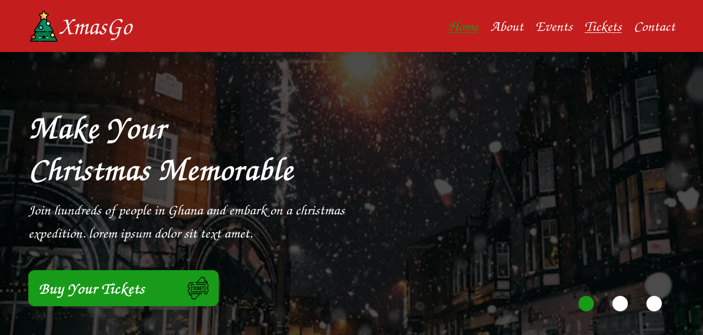

# This is a Christmas website I build for events

## Table of contents

- [Overview](#overview)
  - [The challenge](#the-challenge)
  - [Screenshot](#screenshot)
  - [Links](#links)
- [My process](#my-process)
  - [Built with](#built-with)
  - [What I learned](#what-i-learned)
- [Author](#author)

## Overview

### The challenge

Users should be able to:

- See hover and focus states for all interactive elements on the page

### Screenshot

### Links

- Solution URL: [Add solution URL here](https://github.com/Adu-Boahen/blog-preview-card.git)
- Live Site URL: [Add live site URL here](https://christmaswebsiteforevents.netlify.app)

## My process

### Built with

- Semantic HTML5 markup
- CSS custom properties
- Flexbox
- CSS Grid
- Mobile-first workflow
- javascript

### What I learned

I improved my knowledge on responsive design and the use of css flexbox as well.
I learnt about javascript Dom and also responsive design

## Author

- LinkedIn - [Adu-Boahen](https://www.linkedin.com/profile/Adu-Boahen)
- Frontend Mentor - [@Adu-Boahen](https://www.frontendmentor.io/profile/Adu-Boahen)
# christmasPartyWebsite
